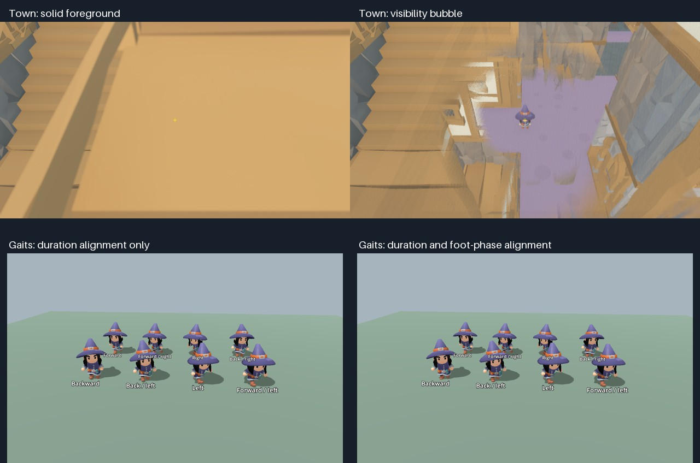

# Tactical camera and directional movement

Feature branch: `codex/tactical-camera-controls`, based on `f3203d96`.
Merged into `main` at `6f6076e8`; the testing follow-up below restores movement
speed and adds a reversible view comparison.

## Controls and framing

- Camera: 26 m horizontal distance, 16 m above the player's feet, looks at 1 m
  above the feet, 50-degree perspective FOV. Approximately 30 degrees downward.
- F7 switches between this view and the original 8 m / 5 m, 75-degree FOV
  camera, including its original follow and collision response. Switching
  retains the current yaw and resets follow history. The old view restores
  opaque materials; the tactical view enables the visibility bubble. Both
  views keep mouse-facing and camera-relative movement. Key repeat is ignored.
- WASD moves relative to the current camera. Mouse aim controls facing even
  while stationary, airborne, or travelling sideways/backwards.
- Mouse rotation starts only after reaching the actual left/right viewport edge.
  Only the outward portion of each movement rotates; movement inside the window,
  dwelling at the edge, and returning inward cause no rotation. No button is required.
  A full viewport-width of outward drag turns by one horizontal field of view;
  at 1280 × 800 and FOV 50, 100 pixels turns approximately 5.7 degrees (previously
  34.4 degrees). The scale follows viewport size and FOV without time acceleration.
  At the edge, raw mouse capture retains a visible cursor and its aim position.
  Moving inward, clicking, F7, focus loss or pausing releases capture. Escape
  releases the cursor until the next click in the game. Q/E still works.
- The aim ray meets a plane at the player's feet, so foreground roofs cannot
  steal aim. A 25 cm zone at the player's feet holds the last facing direction.
- Player movement again reaches the original 10 m/s land speed in all directions;
  diagonal input is normalized. The initial feature's stride-based travel limits
  (4.2 m/s forward, 4.66 sideways, 1.6 backward) have been removed at the owner's
  request. Swimming keeps its existing 4.5 m/s cap. Measured strides still set
  animation blend weights and cadence, capped at 2.5 cycles per second. The
  available short backward walking clip cannot match 10 m/s without foot sliding;
  animation phase alignment is preserved, while travel speed takes precedence.

## Animation evidence

The source clips have different durations **and different foot phases**. Their
`.res` loop modes are also disabled. Equalizing duration alone leaves their
left/right support phases misaligned, and node-level looping alone does not
turn on interpolation across the source resource's loop boundary.

`gait_phase_report.gd` samples the real Mage skeleton at 120 phases per source
clip. `source-gaits.json` retains foot/toe positions; `phase-analysis.json`
compares normalized left-minus-right foot heights against Running_A.

| Clip | Source duration | Applied phase offset | Error before → after |
|---|---:|---:|---:|
| Running_A | 0.800 s | 0 | 0 → 0 |
| Walking_A | 1.067 s | 1/6 cycle | 1.018 → 0.028 |
| Walking_Backwards | 1.067 s | 3/4 cycle | 2.051 → 0.014 |
| Running_Strafe_Left | 0.800 s | 0 | 0.122 → 0.122 |
| Running_Strafe_Right | 0.800 s | 0 | 0.116 → 0.116 |

The strafe signals' optimum is within one sample of zero; the existing phase
is retained. The aligned sources use a common one-second timeline and one
cadence controller, with sync enabled even at zero blend weight. Idle is a
separate blend, so diagonals never pull in an unintended idle pose. The editable
`characters/animations/DirectionalAnimationTree.tres` exposes the blend and phase
settings in Godot. Each character owns private animation graph/library copies.
Direction and cadence transitions are smoothed to avoid abrupt reversal pops. Jump and swim-entry
one-shot behavior remains intact.

Godot applies start_offset before stretching the timeline, so these offsets
are **normalized timeline seconds**, not original-clip seconds. This was checked
against [Godot 4.5's animation implementation](https://github.com/godotengine/godot/blob/4.5/scene/animation/animation_blend_tree.cpp).

Actual AnimationTree tests inspect eight directions through two full cycles:
ankles remain above the floor, adjacent 1/120 s samples stay continuous through
wraps, and each direction retains alternating leg lift. Rendered review uses
30 frames across two cycles, with additional views of diagonals and backpedal.
These are blend/continuity checks; this feature does not add foot-placement IK.

## Visibility bubble

The camera performs a render-bounds query every 100 ms, or immediately after
moving more than a metre. A corridor narrow phase excludes the floor and distant
objects. Using rendered geometry rather than physics rays also catches
non-collidable trim, foliage and independent neighbouring building components.

A material adapter evaluates world-space coverage per fragment between the
player and the camera, fading smoothly across a 3.8 m radius. The core leaves
12% pixel coverage. Depth ordering and shadows are retained; separate layers
share the coverage pattern rather than compounding opaque fragments. The
player's own descendants, surfaces below their feet, and geometry behind the
view corridor remain visible normally. A moving bubble restores original
material references, including MultiMesh resources, when they leave its bounds.
Shader variants are shared among matching material sources. Live source uniforms,
including water's changing textures, continue to propagate to faded wrappers.
The protected floor uses the physical foot height independently of the smoothed
visual focus, so stepping up does not fade the supporting floor.

The effect is **dithered transparency**, not sorted alpha blending. It works
with the project's MeshInstance3D/MultiMeshInstance3D world, including collision-free
components; CSG roots are also handled. Custom spatial shader code is preserved.
The native PBR adapter preserves the project's texture sampling, vertex colour,
albedo, normal, metallic, roughness, AO, emission, cull and transparency settings.
Exotic future native-material features such as parallax/triplanar mapping are
not covered by this adapter; they should use an equivalent custom spatial
shader or extend the shared adapter, never per-object fade scripts. Particle
systems and labels are not selected as solid occluders.

## Reproduction

Run with the Godot 4.5.1 executable and this worktree as `--path`:

```text
--headless -s res://tests/harness/gait_phase_report.gd
res://tests/harness/tactical_review.tscn
res://tests/harness/tactical_review.tscn -- --gaits
res://tests/harness/tactical_review.tscn -- --views
res://tests/harness/tactical_world_review.tscn -- --all --output <output-directory>
```

Small synthetic captures go to `.artifacts/tactical/`. Bulk render frames remain
ignored local QA artifacts, following the repository's consolidation policy.
`pixel-checks.json` records the synthetic comparisons: restoring the original
resources is pixel-exact; the distant member of the same MultiMesh and an
unobstructed floor region remain pixel-exact during fading. The native adapter
at zero fade differs by at most 2/255 per channel from Godot's generated shader.
That small difference is a renderer/material-adapter limit, not a geometry change.

## Validation

### View and speed follow-up

The `--views` harness renders the production camera controller in both modes
and after returning to tactical mode. Captures in `.artifacts/tactical-views/`
verify the wider framing at 29.982 degrees downward, original framing at
32.005 degrees downward, and a pixel-identical restored tactical frame. These are synthetic
framing checks; the town measurements below predate this follow-up and used
the initial 14 m / 16 m tactical camera.

The follow-up passes 31 tests / 286 assertions across controls, camera collision,
streaming intent, directional animation, visibility, stairs and swimming. The new
regressions exercise actual player inputs in all directions and camera quadrants,
the 10 m/s streaming intent, F7 repeat suppression, both camera poses/FOVs, and
the original view's collision response. Both test runs and the graphical capture
exit successfully. The repository-wide suite was not repeated for this follow-up.

### Edge-drag follow-up

The former outer 22.5% activation area is removed. Regression coverage includes
reaching the last pixel without turning, crossing with only partial overflow,
continued motion while clamped, inward return without undoing a pending turn,
FOV/resolution scaling, GUI button clicks at the drawn cursor, F7, focus loss
and Escape release. Controls and camera checks pass 14 tests / 107 assertions
headlessly; the eight controls tests also pass all 88 assertions in a native
graphical window. Both final processes exit 0.

Godot's macOS confined mode clamps the reported delta at the boundary, so the
camera temporarily uses captured mode to receive continued outward movement.
See the [Godot 4.5 macOS input implementation](https://github.com/godotengine/godot/blob/4.5/platform/macos/display_server_macos.mm#L1313)
and [mouse mode documentation](https://docs.godotengine.org/en/4.5/classes/class_input.html).
Corrected cursor events are dispatched once through the viewport so GUI hover
and clicks follow the drawn cursor; clicks restore normal physics picking.

### Original feature validation

Final focused controls, animation, camera, visibility, stair and swim checks pass:
28 tests, 241 assertions. The additional GPU checks also exercise actual MultiMesh
buffer transforms and live shader-uniform updates. The final GPU repeat passed six tests / 27 assertions and exited 0. An earlier
GPU-only run passed its assertions but hit signal 11 during engine shutdown;
that event and the successful rerun are retained in `focused-tests.json`.
Both final graphical capture harnesses exited 0 without script/shader errors.

The production render harness uses the current streamed town at
(237.4, 8.0, -370.2), with matched before/zero-fade/after views in four orientations.
An additional balcony review uses (227.1, 20.1, -369.7). The numeric CPU timings
measure warmed bubble updates, including periodic bounds queries; they do not
measure GPU frame cost, first-use shader compilation, or total streaming performance.

Across four town views the final bubble selected 60–64 components and 63–69
source materials, sharing 6–7 shader variants. Warm median update cost was
1.463–1.647 ms and the largest sampled update was 2.245 ms while the broad suite
also ran on this machine. See `town-metrics.json` for each view.



The local animation loop is available at
[directional-gaits.gif](../../../.artifacts/tactical/directional-gaits.gif).
The image above is one pose sample; the 30-frame render sequence and skeleton
continuity checks provide the motion evidence.

The repository-wide run completed **1,208 tests in 157 scripts**: 1,177 passed,
30 failed and one was pending, with 401,374 / 401,467 passing assertions in
3,239.537 seconds. Every failing test name matches the September 10 consolidation
baseline; there are no added or missing failure names. The baseline cliff,
cold-start, composition and historical-water failures remain unresolved.
The process exited 134 after the complete summary with the same
`recursive_mutex lock failed` shutdown error recorded in that baseline.
See `full-suite.json` for the exact comparison.

The broad run used a frozen feature copy. The later physical-floor protection,
live material-uniform synchronization and return-to-centre orbit guard were
verified by the final focused run; visibility was also checked on the GPU and
in matched synthetic/town renders. The frozen source files and complete logs
are retained locally under `.artifacts/tactical/validation/`; both the frozen
and final source hashes are recorded in the versioned JSON reports.
