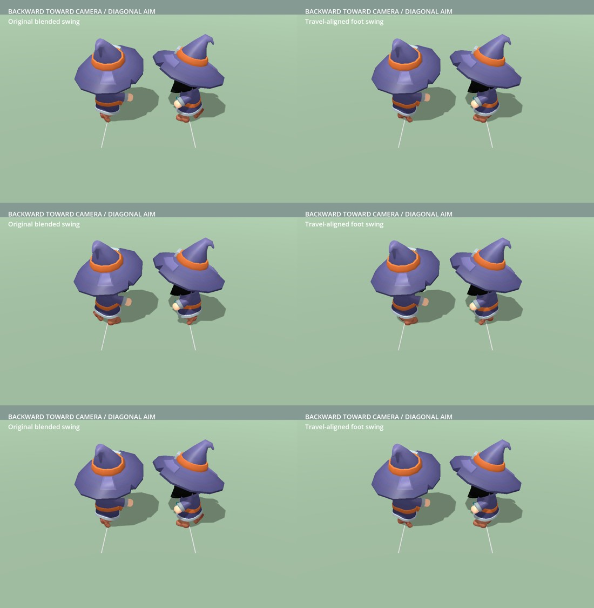

# Continuous input and full-stride correction

The owner rejected the confinement implementation: no drawn cursor appeared,
rotation did nothing and the first native edge exit stopped movement. Its passing
native unit tests did not establish that the embedded game worked.

## Input

The camera now acquires raw mouse input on the first focused game motion and
retains it while the virtual cursor moves through the centre and across edge
returns. Only the part of a relative motion beyond the virtual side boundary
adds yaw. The operating-system cursor no longer travels to a native side boundary
before capture starts. Sensitivity remains 1.6 times the FOV-based gain. Staying
still produces no rotation. Escape releases until the next game click; focus
loss and F7 also release. Clicks restore native picking at the drawn pointer and
raw capture resumes on subsequent unpressed motion.

The new acquisition invariant fails on the confinement version before passing.
The focused input test also covers crossing, inward return without changing
native mode, click coordinates, Escape, focus loss, view toggles and retained
movement actions.

`tactical_loaded_input_review.tscn` uses the real production loading screen to
load the cube test, production character and camera. The owner explicitly
confirmed **rotation and WASD together** in the separate native window, then
confirmed **rotation and WASD together in the editor’s embedded window**.
The embedded trace contains 178 button-free turning samples, with both yaw
signs observed; raw motion and yaw changes are retained in local diagnostic logs.
This is stronger evidence than the earlier synthetic-event tests.

## Visible foot swing

The reported case is fixed camera-backward travel with diagonal forward aim.
At body yaw 135° and 225°, the previous blend's full foot trajectory was
32.16°/31.97° and 30.56°/32.95° away from world travel (left/right feet).
The previous contact-only tests missed this lifted portion of the stride.

`DirectionalStride.gd` runs after animation playback as a SkeletonModifier3D.
Each foot retains its source height and stance width while its horizontal swing
is projected into the current smoothed travel plane. An analytic two-bone solve
preserves thigh/shin lengths, and the ankle retains its source orientation.
Only leg branches change; head and torso remain aimed by the existing animation.
The correction fades with locomotion and is inactive while airborne or swimming.
It uses the current walk/run calibration rather than assuming full-speed running.

The failing full-stride invariant now measures less than 0.001° error in those
four sampled trajectories. A separate test observes the **automatic production
modifier callback**, verifying head pose, foot height and leg lengths. Reversal
continuity and moving-aim tests also evaluate corrected poses. The owner then
confirmed that the feet follow travel in the embedded diagonal-aim/S test.

Two matched 30-frame render sequences use the real modifier and the same camera.
Run `tactical_stride_review.tscn`; add `-- --uncorrected` for the previous swing.
The ground lines mark camera-backward travel. Bulk PNG frames remain local.

[Local animated comparison](../../../.artifacts/tactical-embedded-validation/full-stride-comparison.gif).

## Checks and scope

The focused run passes 33 tests / 399 assertions, including input, locomotion,
camera, stairs and swimming. The later corrected-pose locomotion rerun passes
10 tests / 147 assertions. Native-window input checks pass 9 tests / 96 assertions after explicitly
focusing the first test window. The initial unfocused test correctly failed
the acquisition guard and was corrected.
Both matched render processes exit successfully with no script errors.

The normal project is launched through `mythos_loading_screen.tscn`, without the
traced-camera subclass, for the final full-game check. Its nine-chunk terrain startup
completes in 230.079 seconds; final manual confirmation is pending. The owner's confirmations above
establish the separate and embedded small tests; they do not substitute for a
normal-game confirmation.

Implementation reference: [Godot SkeletonModifier3D](https://docs.godotengine.org/en/4.5/classes/class_skeletonmodifier3d.html),
which schedules the correction after animation playback and exposes the modified
pose through `modification_processed`.
