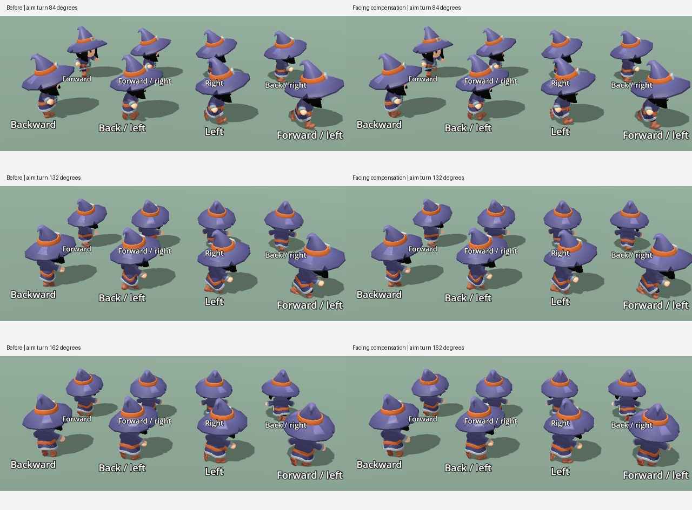

# Embedded input and moving-aim follow-up

**Rejected in the owner’s subsequent normal-game test.** Confinement did not
produce working rotation and movement stopped on the first exit. The replacement
and confirmed tests are in [continuous input and full stride](continuous-input-and-stride.md).

The separate-window cube demonstration missed the reported embedded-game failure.
The earlier follow-up's native input tests did not establish embedded acceptance.

## Mouse boundary

The first embedded trace stops at x=1918 in a 1920-wide Retina viewport while
the old code requires x=1919. Godot's macOS backend scales cursor points into
backing pixels. The final reachable point now uses that scale and the viewport
transform, retaining an edge-only activation boundary.

The owner's next test established that button dragging worked but unpressed
movement did not. A button drag delivers motion beyond the native window;
ordinary motion may deliver only `mouse_exited` when crossing between samples.
An exit-handler attempt still failed in the owner's actual game and was rejected.

Both `Window.position` and the native window position can report (0,0) for the
editor's virtual game window, even on an offset monitor. Anchoring that origin to
each delivered event also failed: the native cursor query was ahead of the
buffered event, making the estimated origin drift with fast motion. A right exit
at native x=3454 was reported inside the 3432-wide game at x=3353; left exits were
similarly misclassified. Neither coordinate-mapping attempt is retained.

The replacement uses native visible confinement while the tactical game has
focus. This guarantees a final side-edge sample without requiring a held mouse
button. At that sample it switches to raw capture for subsequent outward motion.
Only outward displacement turns the camera; moving inward immediately restores
the ordinary pointer. Native hover and picking remain available in the centre.
Escape releases both centre confinement and edge capture until the next game
click; top/bottom motion, view changes, focus loss and camera replacement also
release ownership. No global screen origin is estimated and no movement actions
are cleared. Embedded acceptance of this replacement is recorded below.

Mouse sensitivity is now 1.6 times the earlier FOV-based gain. Distance remains
the rotation authority; increasing elapsed time without moving adds no rotation.

Implementation references: [Godot's macOS motion/exit dispatch](https://github.com/godotengine/godot/blob/4.5/platform/macos/godot_content_view.mm#L566),
[native confinement and capture](https://github.com/godotengine/godot/blob/4.5/platform/macos/display_server_macos.mm#L1209)
and [Retina display scaling](https://docs.godotengine.org/en/4.5/classes/class_displayserver.html#class-displayserver-method-screen-get-max-scale).

## Feet while aiming

Individual planted-foot checks remain within 10° on the sampled backward
diagonals, but holding world travel constant while turning the body at 180°/s
reproduces 10.87°, 14.69° and 12.93° errors. The previous blend smoothing kept
weights in the old body-facing frame. That explains why static direction tests
passed while mouse aiming still made the steps appear misdirected.

Before smoothing travel changes, the previous gait is now carried from its old
facing frame into the current one using the inverse of the measured contact-angle
calibration. Thus body aiming does not add another directional lag. Existing
movement-direction smoothing, head pose, phase alignment and movement speed remain.
Simply dropping the smoothing introduced a 0.63 m foot jump in the reversal test
and was rejected; smoothing world yaw also failed that continuity check. The final
frame compensation passes both moving-aim direction and the existing reversal
continuity limit.

`tactical_review.tscn -- --gaits --retargeted --full-speed --turning` renders the
final eight-direction sequence. Add `--unrebased` to reproduce the original
facing-frame lag. Three matched phase pairs are shown below; the complete local
30-frame sequences accompany them.

## Verification

The Retina, confinement and moving-aim regressions first fail before their fixes.
Before replacing the failed exit handler, the focused headless run passed 31
tests / 392 assertions across controls, animation, camera, stairs and swimming.
That result did not establish working embedded mouse input. The final confinement run passes 31 tests / 402 assertions; native-window
controls pass 9 tests / 113 assertions, including centre Escape, click-to-resume
and toolbar access. Both runs exit 0.
The native regression uses real focused Windows;
an earlier graphical attempt used an unattached SubViewport and was rejected as
an invalid window-input setup. Both matched animation render processes exit 0.

The real production scene is instrumented by
`tests/harness/tactical_game_input_review.tscn`: it retains the full streamed
world, production character, visibility and overlays, and records native exits,
input actions, physics ticks, position and camera yaw. The replacement full-game
run finishes its nine-chunk startup in 246.215 seconds. Its native trace records
visible-to-confined mode 0 → 3 with button mask 0 and retains mode 3 across
subsequent physics ticks. This establishes that the embedded game accepts the
confinement request, not that physical button-free outward motion is correct.
The full game remains open for the owner's requested rotation-and-WASD check;
that final manual acceptance is pending. Automated UI drags hold a button, and
its synthetic pointer repositioning does not supply representative raw deltas.
